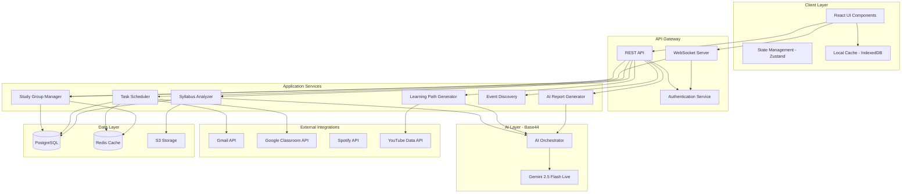

# Design Document: SIDAR Learning Companion

## Overview

SIDAR is an AI-native learning companion platform built on a modern web architecture that integrates multiple AI and third-party services. The system uses React for the frontend with Tailwind CSS and Shadcn/UI for styling, while leveraging the Base44 platform with Gemini 2.5 Flash Live for real-time AI interactions. The architecture follows a modular design with clear separation between presentation, business logic, and data layers.

The platform addresses student overwhelm by centralizing fragmented learning tools into a single, context-aware dashboard. Key design principles include:

1. **AI-First Architecture**: All major features leverage AI for intelligence and automation
2. **Real-Time Synchronization**: WebSocket-based communication for live collaboration
3. **Progressive Enhancement**: Core features work offline with sync when online
4. **Modular Integration**: Clean interfaces for third-party services (Gmail, Google Classroom, Spotify)
5. **Privacy by Design**: End-to-end encryption for sensitive data with minimal data collection

## Architecture

### High-Level Architecture



### Component Architecture

The system follows a layered architecture:

**Presentation Layer (React)**
- Component-based UI using React 18+ with hooks
- Shadcn/UI for consistent, accessible component library
- Tailwind CSS for utility-first styling
- Zustand for lightweight state management
- React Query for server state synchronization

**API Layer**
- RESTful API for CRUD operations and queries
- WebSocket server for real-time features (study groups, notifications)
- JWT-based authentication with refresh tokens
- Rate limiting and request validation

**Business Logic Layer**
- Service-oriented architecture with clear domain boundaries
- Each service encapsulates specific business logic
- Services communicate through well-defined interfaces
- Event-driven architecture for cross-service communication

**AI Integration Layer**
- Base44 platform integration for Gemini 2.5 Flash Live
- AI Orchestrator manages context, prompts, and response streaming
- Separate AI agents for different domains (syllabus analysis, learning paths, reports)
- Caching layer for frequently requested AI responses

**Data Layer**
- PostgreSQL for relational data (users, tasks, groups, resources)
- Redis for caching and real-time data (sessions, WebSocket state)
- S3 for file storage (uploaded syllabi, documents, media)
- IndexedDB for client-side offline storage

## Components and Interfaces

### 1. Syllabus Analyzer Service

**Responsibility**: Extract structured information from uploaded syllabus documents (PDF, images)

**Interface**:
```typescript
interface SyllabusAnalyzer {
  analyzeSyllabus(file: File, userId: string): Promise<SyllabusData>
  extractTopics(content: string): Promise<Topic[]>
  extractDeadlines(content: string): Promise<Deadline[]>
  getSyllabusById(syllabusId: string): Promise<SyllabusData>
}

interface SyllabusData {
  id: string
  userId: string
  fileName: string
  uploadedAt: Date
  topics: Topic[]
  deadlines: Deadline[]
  rawContent: string
}

interface Topic {
  id: string
  title: string
  description: string
  order: number
  estimatedHours: number
}

interface Deadline {
  id: string
  title: string
  date: Date
  type: 'assignment' | 'exam' | 'project' | 'other'
  relatedTopicIds: string[]
}
```

**Implementation Details**:
- Uses Gemini 2.5 Flash Live for document understanding
- PDF parsing via pdf.js for text extraction
- Image OCR via Gemini's vision capabilities
- Structured output using JSON mode for consistent parsing
- Stores original files in S3 with metadata in PostgreSQL

### 2. Learning Path Generator

**Responsibility**: Create personalized learning sequences with curated resources

**Interface**:
```typescript
interface LearningPathGenerator {
  generatePath(syllabusId: string, userId: string): Promise<LearningPath>
  curateResources(topic: Topic): Promise<Resource[]>
  updateProgress(pathId: string, resourceId: string, completed: boolean): Promise<void>
  getPathProgress(pathId: string): Promise<PathProgress>
}

interface LearningPath {
  id: string
  userId: string
  syllabusId: string
  createdAt: Date
  steps: LearningStep[]
}

interface LearningStep {
  id: string
  topicId: string
  order: number
  resources: Resource[]
  estimatedDuration: number
}

interface Resource {
  id: string
  type: 'video' | 'article' | 'document' | 'interactive'
  title: string
  url: string
  source: 'youtube' | 'web' | 'internal'
  duration: number
  difficulty: 'beginner' | 'intermediate' | 'advanced'
  completed: boolean
}

interface PathProgress {
  pathId: string
  totalSteps: number
  completedSteps: number
  totalHours: number
  completedHours: number
  currentStep: LearningStep
}
```

**Implementation Details**:
- AI generates learning sequence based on topic dependencies
- YouTube Data API for video search and metadata
- Web scraping (with rate limiting) for article curation
- Collaborative filtering for resource recommendations
- Progress tracking with completion timestamps

### 3. AI Study Assistant

**Responsibility**: Provide multimodal conversational AI support

**Interface**:
```typescript
interface AIAssistant {
  sendMessage(userId: string, message: TextMessage | VoiceMessage | ImageMessage): Promise<AssistantResponse>
  getConversationHistory(userId: string, limit: number): Promise<Message[]>
  clearContext(userId: string): Promise<void>
}

interface TextMessage {
  type: 'text'
  content: string
  timestamp: Date
}

interface VoiceMessage {
  type: 'voice'
  audioData: Blob
  timestamp: Date
}

interface ImageMessage {
  type: 'image'
  imageData: Blob
  caption?: string
  timestamp: Date
}

interface AssistantResponse {
  id: string
  content: string
  timestamp: Date
  sources?: Source[]
  suggestedActions?: Action[]
}

interface Source {
  title: string
  url: string
  relevance: number
}

interface Action {
  type: 'create_task' | 'add_resource' | 'schedule_study'
  label: string
  payload: any
}
```

**Implementation Details**:
- Gemini 2.5 Flash Live for real-time streaming responses
- Voice transcription via Gemini's audio capabilities
- Image analysis for homework help, diagram explanations
- Context window management (last 10 messages + user profile)
- Suggested actions parsed from AI responses

### 4. Task Scheduler Service

**Responsibility**: Manage tasks from multiple sources and send notifications

**Interface**:
```typescript
interface TaskScheduler {
  syncGmail(userId: string): Promise<Task[]>
  syncGoogleClassroom(userId: string): Promise<Task[]>
  createTask(userId: string, task: TaskInput): Promise<Task>
  updateTask(taskId: string, updates: Partial<Task>): Promise<Task>
  deleteTask(taskId: string): Promise<void>
  getUpcomingTasks(userId: string, days: number): Promise<Task[]>
  markComplete(taskId: string): Promise<void>
}

interface Task {
  id: string
  userId: string
  title: string
  description: string
  deadline: Date
  priority: 'low' | 'medium' | 'high'
  source: 'manual' | 'gmail' | 'google_classroom'
  sourceId?: string
  completed: boolean
  completedAt?: Date
  tags: string[]
}

interface TaskInput {
  title: string
  description: string
  deadline: Date
  priority: 'low' | 'medium' | 'high'
  tags?: string[]
}
```

**Implementation Details**:
- Gmail API integration with OAuth 2.0
- Google Classroom API for assignment sync
- Duplicate detection using content hashing
- Redis-based notification queue
- Cron job for periodic syncing (every 15 minutes)

### 5. Wellness Mode Service

**Responsibility**: Adjust learning goals based on health factors

**Interface**:
```typescript
interface WellnessMode {
  enableWellnessMode(userId: string, config: WellnessConfig): Promise<void>
  disableWellnessMode(userId: string): Promise<void>
  updateCyclePhase(userId: string, phase: CyclePhase): Promise<void>
  getAdjustedGoals(userId: string): Promise<AdjustedGoals>
}

interface WellnessConfig {
  enabled: boolean
  cycleLength: number
  adjustmentFactor: number // 0.5 = 50% reduction
  preferredActivities: string[]
}

interface CyclePhase {
  phase: 'menstrual' | 'follicular' | 'ovulation' | 'luteal'
  startDate: Date
  intensity: 'low' | 'medium' | 'high'
}

interface AdjustedGoals {
  dailyStudyHours: number
  taskPriority: 'essential_only' | 'reduced' | 'normal'
  suggestedActivities: string[]
  restDays: Date[]
}
```

**Implementation Details**:
- Encrypted storage for health data
- Configurable adjustment algorithms
- Integration with task scheduler for goal modification
- Privacy-first design with local-only option
- AI suggestions for wellness-appropriate activities

### 6. Study Group Manager

**Responsibility**: Handle real-time collaboration and group management

**Interface**:
```typescript
interface StudyGroupManager {
  createGroup(userId: string, name: string, settings: GroupSettings): Promise<StudyGroup>
  joinGroup(userId: string, roomCode: string): Promise<StudyGroup>
  leaveGroup(userId: string, groupId: string): Promise<void>
  sendMessage(groupId: string, userId: string, message: string): Promise<GroupMessage>
  shareResource(groupId: string, userId: string, resource: Resource): Promise<void>
  getGroupMembers(groupId: string): Promise<GroupMember[]>
  updateDocument(groupId: string, documentId: string, operations: Operation[]): Promise<void>
}

interface StudyGroup {
  id: string
  name: string
  roomCode: string
  createdBy: string
  createdAt: Date
  members: GroupMember[]
  settings: GroupSettings
}

interface GroupSettings {
  maxMembers: number
  isPublic: boolean
  allowResourceSharing: boolean
  allowDocumentEditing: boolean
}

interface GroupMember {
  userId: string
  username: string
  role: 'owner' | 'moderator' | 'member'
  joinedAt: Date
  isOnline: boolean
}

interface GroupMessage {
  id: string
  groupId: string
  userId: string
  username: string
  content: string
  timestamp: Date
  type: 'text' | 'system'
}

interface Operation {
  type: 'insert' | 'delete' | 'format'
  position: number
  content?: string
  attributes?: Record<string, any>
}
```

**Implementation Details**:
- WebSocket server for real-time messaging
- Operational Transformation (OT) for collaborative editing
- Redis pub/sub for message distribution across server instances
- Room code generation using short, memorable codes
- Presence tracking with heartbeat mechanism

### 7. Event Discovery Service

**Responsibility**: Find and recommend educational events

**Interface**:
```typescript
interface EventDiscovery {
  searchEvents(query: string, filters: EventFilters): Promise<Event[]>
  getEventDetails(eventId: string): Promise<EventDetails>
  saveEvent(userId: string, eventId: string): Promise<void>
  getSavedEvents(userId: string): Promise<Event[]>
}

interface EventFilters {
  type?: ('hackathon' | 'workshop' | 'seminar' | 'conference')[]
  location?: Location
  dateRange?: DateRange
  isOnline?: boolean
}

interface Location {
  latitude: number
  longitude: number
  radius: number // in kilometers
}

interface DateRange {
  start: Date
  end: Date
}

interface Event {
  id: string
  title: string
  type: 'hackathon' | 'workshop' | 'seminar' | 'conference'
  description: string
  startDate: Date
  endDate: Date
  location: string
  isOnline: boolean
  url: string
  organizer: string
  tags: string[]
}

interface EventDetails extends Event {
  fullDescription: string
  schedule: EventSession[]
  speakers: Speaker[]
  registrationUrl: string
  cost: number
}

interface EventSession {
  title: string
  startTime: Date
  endTime: Date
  speaker: string
}

interface Speaker {
  name: string
  bio: string
  photo: string
}
```

**Implementation Details**:
- AI-powered web scraping for event aggregation
- Integration with event platforms (Eventbrite, Meetup, Devfolio)
- Geolocation-based filtering
- Caching with daily refresh
- Personalized recommendations based on user interests

### 8. Document Editor Service

**Responsibility**: Provide note-taking with auto-save

**Interface**:
```typescript
interface DocumentEditor {
  createDocument(userId: string, title: string): Promise<Document>
  getDocument(documentId: string): Promise<Document>
  updateDocument(documentId: string, content: string): Promise<void>
  deleteDocument(documentId: string): Promise<void>
  searchDocuments(userId: string, query: string): Promise<Document[]>
  listDocuments(userId: string): Promise<Document[]>
}

interface Document {
  id: string
  userId: string
  title: string
  content: string // Rich text in JSON format
  createdAt: Date
  updatedAt: Date
  tags: string[]
}
```

**Implementation Details**:
- Rich text editor using Tiptap or Lexical
- Auto-save with debouncing (30 second delay)
- Conflict resolution for concurrent edits
- Full-text search using PostgreSQL
- Export to PDF/Markdown

### 9. Spotify Integration Service

**Responsibility**: Embed Spotify playback within the platform

**Interface**:
```typescript
interface SpotifyIntegration {
  authenticate(userId: string): Promise<AuthUrl>
  handleCallback(code: string, userId: string): Promise<void>
  play(userId: string, trackUri: string): Promise<void>
  pause(userId: string): Promise<void>
  search(userId: string, query: string): Promise<SearchResults>
  getCurrentPlayback(userId: string): Promise<PlaybackState>
  createPlaylist(userId: string, name: string, trackUris: string[]): Promise<Playlist>
}

interface AuthUrl {
  url: string
}

interface SearchResults {
  tracks: Track[]
  playlists: Playlist[]
}

interface Track {
  uri: string
  name: string
  artist: string
  album: string
  duration: number
  imageUrl: string
}

interface Playlist {
  id: string
  name: string
  tracks: Track[]
  imageUrl: string
}

interface PlaybackState {
  isPlaying: boolean
  track: Track
  position: number
  volume: number
}
```

**Implementation Details**:
- Spotify Web API with OAuth 2.0
- Spotify Web Playback SDK for in-browser playback
- Token refresh handling
- Playback state synchronization
- Study-focused playlist curation

### 10. AI Report Generator

**Responsibility**: Create weekly learning analytics reports

**Interface**:
```typescript
interface AIReportGenerator {
  generateWeeklyReport(userId: string, weekStart: Date): Promise<AIReport>
  getReportHistory(userId: string): Promise<AIReport[]>
  getReportById(reportId: string): Promise<AIReport>
}

interface AIReport {
  id: string
  userId: string
  weekStart: Date
  weekEnd: Date
  generatedAt: Date
  metrics: LearningMetrics
  insights: Insight[]
  recommendations: Recommendation[]
}

interface LearningMetrics {
  totalStudyHours: number
  tasksCompleted: number
  tasksIncomplete: number
  resourcesConsumed: number
  studyGroupSessions: number
  topTopics: TopicMetric[]
}

interface TopicMetric {
  topicName: string
  hoursSpent: number
  resourcesCompleted: number
}

interface Insight {
  type: 'strength' | 'improvement' | 'pattern'
  title: string
  description: string
  confidence: number
}

interface Recommendation {
  title: string
  description: string
  actionable: boolean
  action?: Action
}
```

**Implementation Details**:
- Scheduled job runs every Sunday at midnight
- Aggregates data from all services
- AI analysis using Gemini for insights
- Notification sent when report is ready
- Historical trend analysis

## Data Models

### User Model

```typescript
interface User {
  id: string
  email: string
  passwordHash: string
  username: string
  fullName: string
  createdAt: Date
  lastLoginAt: Date
  profilePicture?: string
  preferences: UserPreferences
  integrations: UserIntegrations
}

interface UserPreferences {
  theme: 'light' | 'dark' | 'auto'
  notifications: NotificationPreferences
  wellnessMode: WellnessConfig
  studyGoals: StudyGoals
}

interface NotificationPreferences {
  email: boolean
  push: boolean
  taskReminders: boolean
  groupMessages: boolean
  weeklyReports: boolean
}

interface StudyGoals {
  dailyHours: number
  weeklyHours: number
  preferredStudyTimes: TimeSlot[]
}

interface TimeSlot {
  day: number // 0-6 (Sunday-Saturday)
  startHour: number // 0-23
  endHour: number // 0-23
}

interface UserIntegrations {
  gmail: IntegrationStatus
  googleClassroom: IntegrationStatus
  spotify: IntegrationStatus
}

interface IntegrationStatus {
  connected: boolean
  connectedAt?: Date
  accessToken?: string
  refreshToken?: string
  expiresAt?: Date
}
```

### Database Schema

**PostgreSQL Tables**:

```sql
-- Users table
CREATE TABLE users (
  id UUID PRIMARY KEY DEFAULT gen_random_uuid(),
  email VARCHAR(255) UNIQUE NOT NULL,
  password_hash VARCHAR(255) NOT NULL,
  username VARCHAR(100) UNIQUE NOT NULL,
  full_name VARCHAR(255),
  created_at TIMESTAMP DEFAULT NOW(),
  last_login_at TIMESTAMP,
  profile_picture TEXT,
  preferences JSONB,
  integrations JSONB
);

-- Syllabi table
CREATE TABLE syllabi (
  id UUID PRIMARY KEY DEFAULT gen_random_uuid(),
  user_id UUID REFERENCES users(id) ON DELETE CASCADE,
  file_name VARCHAR(255) NOT NULL,
  file_url TEXT NOT NULL,
  uploaded_at TIMESTAMP DEFAULT NOW(),
  raw_content TEXT,
  topics JSONB,
  deadlines JSONB
);

-- Learning paths table
CREATE TABLE learning_paths (
  id UUID PRIMARY KEY DEFAULT gen_random_uuid(),
  user_id UUID REFERENCES users(id) ON DELETE CASCADE,
  syllabus_id UUID REFERENCES syllabi(id) ON DELETE CASCADE,
  created_at TIMESTAMP DEFAULT NOW(),
  steps JSONB
);

-- Resources table
CREATE TABLE resources (
  id UUID PRIMARY KEY DEFAULT gen_random_uuid(),
  learning_path_id UUID REFERENCES learning_paths(id) ON DELETE CASCADE,
  type VARCHAR(50) NOT NULL,
  title VARCHAR(255) NOT NULL,
  url TEXT NOT NULL,
  source VARCHAR(50),
  duration INTEGER,
  difficulty VARCHAR(50),
  completed BOOLEAN DEFAULT FALSE,
  completed_at TIMESTAMP
);

-- Tasks table
CREATE TABLE tasks (
  id UUID PRIMARY KEY DEFAULT gen_random_uuid(),
  user_id UUID REFERENCES users(id) ON DELETE CASCADE,
  title VARCHAR(255) NOT NULL,
  description TEXT,
  deadline TIMESTAMP NOT NULL,
  priority VARCHAR(50) DEFAULT 'medium',
  source VARCHAR(50) DEFAULT 'manual',
  source_id VARCHAR(255),
  completed BOOLEAN DEFAULT FALSE,
  completed_at TIMESTAMP,
  tags TEXT[],
  created_at TIMESTAMP DEFAULT NOW()
);

-- Study groups table
CREATE TABLE study_groups (
  id UUID PRIMARY KEY DEFAULT gen_random_uuid(),
  name VARCHAR(255) NOT NULL,
  room_code VARCHAR(10) UNIQUE NOT NULL,
  created_by UUID REFERENCES users(id) ON DELETE CASCADE,
  created_at TIMESTAMP DEFAULT NOW(),
  settings JSONB
);

-- Group members table
CREATE TABLE group_members (
  group_id UUID REFERENCES study_groups(id) ON DELETE CASCADE,
  user_id UUID REFERENCES users(id) ON DELETE CASCADE,
  role VARCHAR(50) DEFAULT 'member',
  joined_at TIMESTAMP DEFAULT NOW(),
  PRIMARY KEY (group_id, user_id)
);

-- Group messages table
CREATE TABLE group_messages (
  id UUID PRIMARY KEY DEFAULT gen_random_uuid(),
  group_id UUID REFERENCES study_groups(id) ON DELETE CASCADE,
  user_id UUID REFERENCES users(id) ON DELETE CASCADE,
  content TEXT NOT NULL,
  timestamp TIMESTAMP DEFAULT NOW(),
  type VARCHAR(50) DEFAULT 'text'
);

-- Documents table
CREATE TABLE documents (
  id UUID PRIMARY KEY DEFAULT gen_random_uuid(),
  user_id UUID REFERENCES users(id) ON DELETE CASCADE,
  title VARCHAR(255) NOT NULL,
  content JSONB NOT NULL,
  created_at TIMESTAMP DEFAULT NOW(),
  updated_at TIMESTAMP DEFAULT NOW(),
  tags TEXT[]
);

-- AI reports table
CREATE TABLE ai_reports (
  id UUID PRIMARY KEY DEFAULT gen_random_uuid(),
  user_id UUID REFERENCES users(id) ON DELETE CASCADE,
  week_start DATE NOT NULL,
  week_end DATE NOT NULL,
  generated_at TIMESTAMP DEFAULT NOW(),
  metrics JSONB,
  insights JSONB,
  recommendations JSONB
);

-- Events table
CREATE TABLE events (
  id UUID PRIMARY KEY DEFAULT gen_random_uuid(),
  title VARCHAR(255) NOT NULL,
  type VARCHAR(50) NOT NULL,
  description TEXT,
  full_description TEXT,
  start_date TIMESTAMP NOT NULL,
  end_date TIMESTAMP NOT NULL,
  location VARCHAR(255),
  is_online BOOLEAN DEFAULT FALSE,
  url TEXT,
  organizer VARCHAR(255),
  tags TEXT[],
  schedule JSONB,
  speakers JSONB,
  registration_url TEXT,
  cost DECIMAL(10, 2),
  created_at TIMESTAMP DEFAULT NOW()
);

-- Saved events table
CREATE TABLE saved_events (
  user_id UUID REFERENCES users(id) ON DELETE CASCADE,
  event_id UUID REFERENCES events(id) ON DELETE CASCADE,
  saved_at TIMESTAMP DEFAULT NOW(),
  PRIMARY KEY (user_id, event_id)
);

-- Conversation history table
CREATE TABLE conversation_history (
  id UUID PRIMARY KEY DEFAULT gen_random_uuid(),
  user_id UUID REFERENCES users(id) ON DELETE CASCADE,
  message_type VARCHAR(50) NOT NULL,
  content TEXT NOT NULL,
  timestamp TIMESTAMP DEFAULT NOW(),
  is_user_message BOOLEAN NOT NULL,
  sources JSONB
);

-- Indexes for performance
CREATE INDEX idx_tasks_user_deadline ON tasks(user_id, deadline);
CREATE INDEX idx_tasks_completed ON tasks(user_id, completed);
CREATE INDEX idx_group_messages_group_timestamp ON group_messages(group_id, timestamp);
CREATE INDEX idx_documents_user ON documents(user_id);
CREATE INDEX idx_events_date ON events(start_date, end_date);
CREATE INDEX idx_conversation_user_timestamp ON conversation_history(user_id, timestamp);
```

**Redis Data Structures**:

```
# User sessions
session:{userId} -> {sessionData}
TTL: 7 days

# WebSocket connections
ws:user:{userId} -> {connectionId}
ws:group:{groupId} -> Set of {userId}

# Task notification queue
queue:notifications -> List of {taskId, userId, type, scheduledFor}

# Cache for AI responses
cache:ai:{hash} -> {response}
TTL: 1 hour

# Rate limiting
ratelimit:{userId}:{endpoint} -> counter
TTL: 1 minute
```

